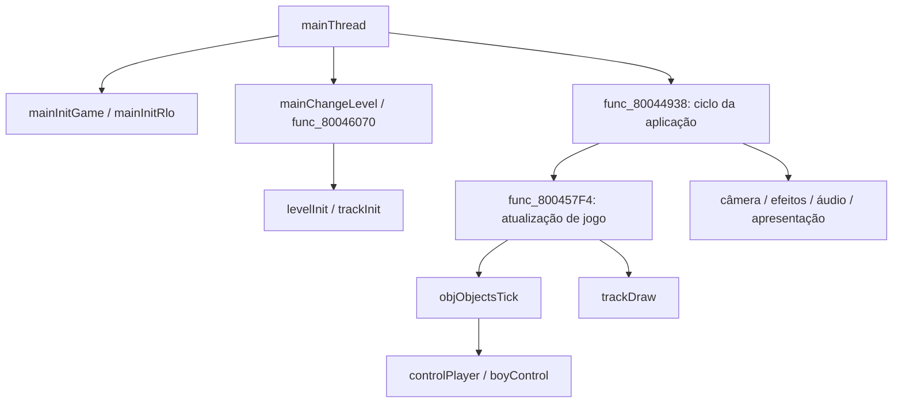
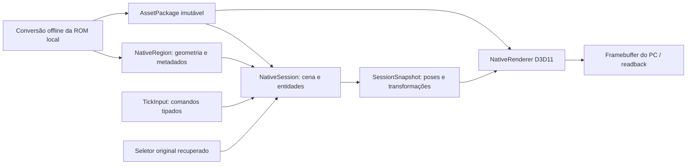

# Arquitetura geral do port nativo

Thiago definiu a prioridade: compreender e integrar o fluxo completo antes
de continuar refinando recortes isolados. O alvo continua Windows x64/NVIDIA,
com código nativo, sem RT64, emulação, código de emuladores ou Android.

O port tem agora um host de aplicação separado dos diagnósticos de animação.
Ele carrega recursos, mantém cenas e entidades, atualiza o mundo em passos
fixos e entrega snapshots ao mesmo renderer D3D11 usado pelas regressões.
O host também carrega a geometria de Forest First com Juno, câmera em
perspectiva e consulta vertical de piso. Ainda não executa o ciclo completo
de gameplay do JFG nem oferece uma fase jogável.

## Fluxo original identificado

`program_map.py` leu o programa matching inteiro identificado pelo ELF,
conferiu **1.500.760 bytes de funções** com a ROM e construiu o inventário:

| Medida | Resultado |
| --- | --- |
| Entradas de função, agrupando aliases do mesmo endereço | 2.941 |
| Funções com tamanho definido | 2.916 |
| Entradas sem tamanho definido | 25 |
| Seções de programa/módulo no ELF | 156 |
| Relações diretas de chamada ou salto entre funções | 14.010 |
| Resolvidas por realocações do programa principal | 513 |
| Resolvidas por realocações dos overlays | 8.467 |
| Pontos indiretos | 206: 36 chamadas e 170 saltos |
| Destinos diretos sem extensão de função identificada | 130 |

Os slots 21 e 56 da tabela de overlays são vazios e não têm seção no ELF.
Saltos indiretos podem ser tabelas de seleção, não necessariamente callbacks.
O grafo não resolve todos esses destinos nem representa execução observada.
Essas contagens não são um percentual de conclusão do jogo.

A tabela de realocações principal possui 520 registros após um cabeçalho
de quatro bytes. Sua origem de código é `0x80000450`, enquanto `.main` no
ELF começa em `0x80000400`. A ferramenta corrige essa diferença de 0x50
antes de relacionar funções. Foram conferidas as ligações `mainInitGame`
→ `mainInitRlo`, `controlPlayer` → `boyControl` e atualização → objetos.

O caminho estático do ciclo principal alcança 2.332 funções em 145 módulos,
mas isso inclui ramos alternativos e serviços de plataforma. A integração
precisa separar esses contratos; não basta compilar todos os destinos.
O mapa completo gerado fica em `build/port-native/integration/program-map.json`;
a [síntese pública](program-map-summary.json) contém raízes e dependências
por módulo, sem instruções ou assets extraídos.

## Fluxo nativo implementado

| Arquivo | Responsabilidade e fronteira |
| --- | --- |
| `scene_assets.h` | Leitura/validação de recursos PC; não inclui Windows ou D3D |
| `region_assets.py` / `region.h` | Conversão e leitura de região, associação ao ponto de entrada e consulta vertical de piso |
| `camera.h` | Matrizes de câmera em perspectiva no espaço do PC |
| `session.h` | Inicialização, transações de cena, vida das entidades, relógio, pausa e encerramento |
| `planar_motion.h` | Movimento provisório separado da seleção/animação |
| `juno_selection.h` | As duas decisões originais já recuperadas e sua ponte para animação |
| `animation_player.h` / `animation.h` | Relógios dos clipes, mistura, poses e hierarquia |
| `renderer.h` / `renderer_d3d11.cpp` | Backend que recebe instâncias prontas; não escolhe clipes nem avança o jogo |
| `session_main.cpp` | Executável de integração por console, sem janela |
| `region_main.cpp` / `region_scenario.h` | Região e personagem no mesmo host, com câmera e entrada controladas |
| `render.cpp` | Frontend dos diagnósticos antigos, agora usando o backend compartilhado |
| `integration_scenario.h` | Entradas/cenas explícitas da prova, sem alegar que sejam uma fase original |

O backend recebe um catálogo de recursos imutáveis. A cena da região usa
Juno (`mesh=0`) e Forest First (`mesh=1`), cada recurso com seus buffers e
texturas. O snapshot da sessão inclui terreno e atores. No modo de mundo,
lotes transparentes são ordenados pela profundidade do centro do lote;
isso não resolve toda interseção de polígonos transparentes. O formato e
a validação continuam limitados aos perfis efetivamente convertidos.

## Ciclo e propriedade dos dados

A sessão passa por `Cold → Ready → Running`, permite pausa/retomada e termina
em `Stopped`. Carregamentos são preparados e validados antes da troca do
mundo ativo. Um erro em qualquer comando do tick preserva o último mundo
confirmado; ticks concluídos anteriormente no mesmo avanço continuam válidos.
O tempo ainda não consumido fica no acumulador, e uma entrada corrigida pode
retomar o tick. Não há descarte silencioso de tempo nem rollback de efeitos
externos: a fonte de entrada retorna dados, não deve realizar essas ações.

O host usa acumulador inteiro racional: soma `nanosegundos × 60` e consome
um tick a cada bilhão de unidades. Isso evita acumular a aproximação de
16.666.667 ns. Um avanço admite até 250 ms; intervalos maiores precisam ser
subdivididos pelo chamador. **60 Hz é política do host**, não uma alegação
de que toda lógica original já tenha sua cadência recuperada.

Durante a pausa, o relógio do host recebe entradas, mas movimento, pose e
tempo do mundo ficam parados. Um comando novo para uma entidade pausada é
validado e mantido para a retomada. A apresentação lê snapshots e não avança
a simulação; não há interpolação de apresentação implementada neste pacote.

Entidades possuem `(geração da cena, slot)`. A troca de cena invalida todos
os identificadores anteriores. Slots removidos não são reutilizados na mesma
geração, evitando ressuscitar referências antigas. Recursos são compartilhados
como constantes; snapshots mantêm sua propriedade enquanto forem usados.
Encerrar a sessão libera o mundo e suas referências, sem invalidar um
snapshot ainda retido pelo consumidor.

As transações usam cópias dos pequenos estados de entidades desta prova.
O renderer também prepara vértices de cada instância na CPU. A estrutura
tem limite de 64 entidades e 64 instâncias por frame; a malha da região
ocupa uma dessas instâncias, deixando até 63 para atores na apresentação.
Custo em cenas grandes, interpolação e otimização de alocações ainda
precisam de medição. A validação a 144 Hz não é benchmark de desempenho.

## Contratos do port completo

| Subsistema original | Contrato nativo / situação |
| --- | --- |
| Inicialização e ciclo principal | Host e ciclo de vida implementados; não chama o boot original completo |
| Memória e carregamento de overlays | Recursos com propriedade explícita; rotinas devem ser adaptadas ou ligadas estaticamente, sem imitar RAM/chips |
| `levelInit`, `trackInit`, listas de objetos | Formatos inspecionados; geometria/material de Forest First e ponto de entrada convertidos. Inicialização completa e comportamentos dos objetos pendentes |
| `objObjectsTick`, `controlPlayer`, `boyControl` | Entidades e comandos integrados; apenas os dois seletores originais foram portados neste caminho |
| Colisão, gravidade e física de personagem | Consulta vertical de piso disponível; gravidade, obstáculos e controle original pendentes |
| Câmera, desenho de mundo e materiais | Perspectiva, catálogo e terreno ativos em D3D11; câmera jogável, céu e efeitos originais pendentes |
| Armas, projéteis, inimigos e scripts | Pendente; deverá usar a mesma vida de entidades, sem cenários paralelos isolados |
| Áudio e música | Saída/síntese ainda não integradas |
| Interface, salvamento e entrada física | Pendentes; só há entrada de teste e encerramento controlado |

`requireOriginalService` rejeita pedidos dos serviços ainda ausentes. Pedir
uma cena marcada como gameplay original também falha; `regionId` identifica
separadamente a geometria convertida. Não há stubs de áudio,
colisão, salvamento ou dispositivos que retornem sucesso fictício.

Os perfis legados em `port/boot`, `port/init`, `port/objects` e similares
são evidência histórica delimitada. Seus contratos de RAM/PI/VI/filas e suas
referências antigas precisam de revisão antes de qualquer aproveitamento;
não estão ligados ao host atual nem autorizam retomar emulação.

## Evidência e próximo marco

Linux ASAN/UBSAN e Windows passaram em nove casos de sessão e 18 rejeições,
com recursos sintéticos e reais. A mesma sequência preserva estado,
posição, orientação, fase de clipe e matrizes em 12 pontos comuns de meio
segundo sob apresentação a 30, 60 e 144 Hz. Isso inclui pausa, troca de cena, criação/remoção e entradas
que usam identificadores inválidos.

A RTX executou duas cenas de diagnóstico, quatro criações de entidade no
total e até duas simultâneas. São 180 frames, 150 imagens distintas e 31
frames idênticos cobrindo a pausa. As cinco provas gráficas anteriores
permaneceram idênticas byte a byte após separar o backend. [Evidência](integration-validation.json).

Forest First foi integrada a esse mesmo host com Juno, escala original,
câmera em perspectiva e consulta de piso. A RTX produziu 180 frames distintos;
as seis provas gráficas anteriores permaneceram idênticas byte a byte.
Capturas separadas do cenário e do personagem conferem sua contribuição
na imagem conjunta. [Resultado e limites](REGION.md).

O próximo marco é **movimento e colisão dentro dessa região**, começando
pelo contrato de controle, gravidade, piso e obstáculos. As particularidades
de animação entram nesse contexto, preservando as regressões do host.
