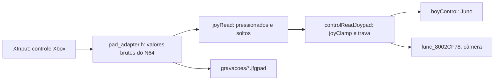

# Forest First jogável com controle

`jfg_native_play.exe` abre Forest First numa janela do Windows com o Juno
controlado por um controle Xbox. O movimento, a colisão, a câmera e a leitura
do controle são as rotinas originais portadas para C++, descritas em
[MOVEMENT.md](MOVEMENT.md). Não há emulação: o controle do PC vira os valores
brutos do controle do N64, e o código do jogo os lê como no console.

## Como o controle chega ao jogo



O adaptador é um serviço do port, não lógica do jogo. Ele aplica só uma zona
morta radial para controles com folga e leva o curso inteiro do analógico ao
valor bruto 80. A zona morta e o alcance do jogo continuam no `joyClamp`
original. Um tique do host a 60 Hz lê o controle uma vez, como um quadro do
N64.

| Controle Xbox | N64 | Efeito no Juno (modo Normal) |
| --- | --- | --- |
| Analógico esquerdo | analógico | andar e correr, em relação à câmera |
| A | A | pulo; parado, segurar carrega o pulo; agachado, levanta |
| Analógico direito | C-buttons | esquerda/direita: passo lateral e câmera; agachado, rolar |
| B, X | B | agachar; correndo, deslizar; com o analógico, andar agachado |
| LT, RB | R | mira em pé: o analógico mira e gira na borda; agachado: **parada** |
| RT | Z | tiro: **parada** quando `boyCanFire` permite |
| LB | L | sem leitura no personagem |
| D-pad | D-pad | trocar arma: inerte com uma arma só |
| Start | Start | pausa do host; o menu original não foi portado |
| Back | função do port | recomeça no ponto de entrada |

`controles.ini` troca botões, ajusta a zona morta e escolhe o modo Normal
ou Expert do menu original. A versão distribuída é igual ao padrão, e
`check_play` confere isso.

## Parada estrita

Quando o Juno faria algo que o port ainda não executa, o tique falha com
`NotPortedError` e a sessão congela no último mundo confirmado. A janela
mostra o motivo em português e o detalhe técnico. Repetir recomeça no ponto
de entrada; Cancelar sai. Nada é ignorado em silêncio: seguir adiante
levaria o port para um caminho diferente do original.

Esc sai, F5 recomeça e Alt+Enter alterna a tela cheia sem borda. Se a janela
for arrastada, o tempo parado acima de 250 ms é descartado e contado no
registro da sessão, em vez de ser simulado de uma vez.

## Gravações

Cada sessão grava `gravacoes/sessao-DATA-HORA.jfgpad` e um resumo `.txt`.
O arquivo guarda o resumo dos dados convertidos, o modo de controle e, para
cada tentativa de tique, os valores brutos do N64 e os comandos do host
(reinício e pausa). Uma tentativa que parou é repetida pelo registro
seguinte no mesmo tique.

`jfg_native_replay.exe PASTA GRAVACAO` reproduz a gravação sem janela, no
Windows ou no Linux, pelo mesmo `PlayRun` do jogo. As paradas acontecem na
mesma tentativa e no mesmo tique. É assim que uma sessão de Thiago vira um
caso reproduzível.

## Verificação

- `check_play`, no Linux com ASAN/UBSAN e na RTX, cobre o adaptador, o
  `controles.ini`, a gravação, arquivos corrompidos, a reprodução igual à
  sessão direta, parada, reinício, pausa e o modo Expert.
- O roteiro de movimento gravado e reproduzido chega ao mesmo estado no Linux
  e na RTX.
- `--autoteste` roda o roteiro no executável de jogo. A sessão SSH da RTX não
  tem área de trabalho e recusa a swap chain (`0x887A0022`); o teste então
  desenha no mesmo alvo 4:3 da janela, sem apresentar, e confere 640 × 480
  contra o caminho das provas, três tamanhos de janela, a parada e o
  reinício. Janela, `Present` e controle físico dependem do teste de Thiago.

Resultados em [movement-validation.json](movement-validation.json).

## Limites

- Só Forest First e só o Juno. Sem inimigos, objetos, portas, itens, sons,
  céu, menus ou salvamento.
- Mira agachada, tiro, água, lava e os demais estados param a sessão.
- As rotações de juntas do tronco e da cabeça não foram portadas.
- O teste remoto não abre a janela; ela só foi verificada no PC de Thiago.

## Reprodução

```sh
python3 port/native/prepare_assets.py --movement --out build/port-native/movement
python3 port/native/build.py
python3 port/native/package.py --out build/port-native/movement
```

`package.py` gera também `jogar.zip`, só com o jogo, o reprodutor e os dados
privados. Ele fica fora do repositório e é copiado para uma pasta nova no PC
de Thiago pelo método de acesso autorizado.
